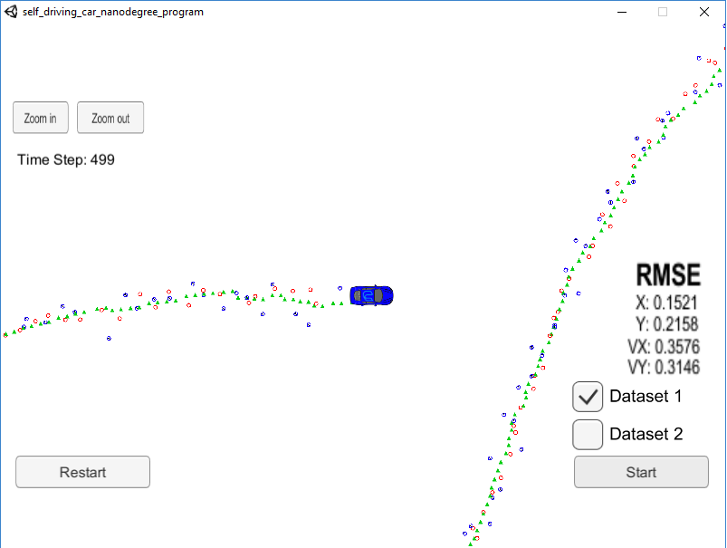
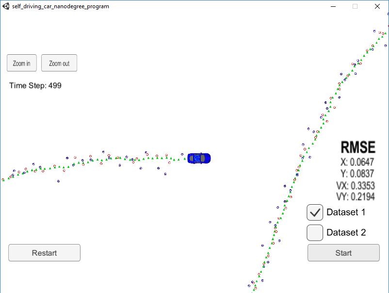

# Unscented Kalman Filter Project Starter Code
Self-Driving Car Engineer Nanodegree Program

In this project I used an Unscented Kalman Filter to estimate the state of a moving object of interest with noisy lidar and radar measurements. Passing the project required obtaining RMSE values that are lower that the tolerance outlined in the [project rubric](https://review.udacity.com/#!/rubrics/783/view):
"Your px, py, vx, and vy RMSE should be less than or equal to the values [.09, .10, .40, .30]" 

The project starting code can be found [here](https://github.com/udacity/CarND-Unscented-Kalman-Filter-Project)

This project involves the Term 2 Simulator which can be downloaded [here](https://github.com/udacity/self-driving-car-sim/releases)

The main program can be built and run by doing the following from the project top directory.

1. mkdir build
2. cd build
3. cmake ..
4. make
5. ./UnscentedKF

The code files that have been updated were:
* ukf.h
* ukf.cpp

Here is the main protcol that main.cpp uses for uWebSocketIO in communicating with the simulator.

INPUT: values provided by the simulator to the c++ program

["sensor_measurement"] => the measurement that the simulator observed (either lidar or radar)

OUTPUT: values provided by the c++ program to the simulator

["estimate_x"] <= kalman filter estimated position x
["estimate_y"] <= kalman filter estimated position y
["rmse_x"]
["rmse_y"]
["rmse_vx"]
["rmse_vy"]

---
Results: 

Using dataset 1 with just Lidar:

Using dataset 1 with just Radar:

Using dataset 1 with both Lidar and Radar:

Results obtained using the Extended Kalman Filter:

Troubles found and their solution to complete the project:
The main issue that I found after having a clean code was to figure out what kind of values I needed to set for the process noise standard deviation for longitudinal and yaw acceleration, since the value provided on the starting code was quite huge and provided very confusing results.
After making it small enough to pass the project requirements, I decided to leave them both equal to 1. Small improvements can still be obtained fine tuning those values, but I prefer to leave a more readable value. 

Once again, valuable information that helps getting the project working were found on the forum. So, here goes a big thank you for all people that participate on all those discussions.